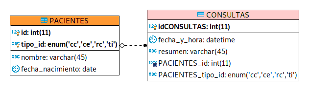
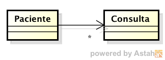

### Escuela Colombina de Ingeniería
### Procesos de desarrollo de Software - PDSW
#### Parcial Segundo tercio


Se está desarrollando un módulo para el departamente de promoción y prevención de una IPS, a partir de una base de datos en la que se han registrado las consultas que han realizado los pacientes a lo largo del tiempo: 




Y para el cual se ha definido un modelo de clases que permite 'mapear' con objetos los datos del modelo anterior:



En el sprint actual, usted es responsable de desarrollar la siguiente historia de usuario, la cual ya tiene definida dos criterios de aceptación:

```text
Como coordinador de salud y prevención
Quiero poder consultar ranking de pacientes que más consultas hayan tenido en un año determinado
Para poder identificar rápidamente a quienes se les debe hacer seguimiento por tener un posible riesgo en su salud

Criterio de aceptación: El sistema debe permitir seleccionar el tamaño del ranking. Es decir seleccionar el número máximo de resultados que se mostrarán en la consulta del ranking.
Criterio de aceptación: El sistema debe permitir seleccionar el año del reporte de una lista (para NO tener que digitarlo), empezando desde 10 años atrás.
Criterio de aceptación: Con los parámetros dados, el sistema debe mostrar los N pacienes con más consultas, ordenados descententemente. Para cada paciente se debe mostrar el nombre, la cédula y el número de consultas realizadas.

```


1. (20%) A partir de la especificación hecha del método _topNPacientesPorAnyo_  (en los servicios de la aplicación), defina al menos una clase de equivalencia 'normal' y una de 'frontera'. Para cada una de éstas implemente una prueba. Haga uso de la plantilla suministrada en la prueba ‘pruebaCeroTest’, en la cual ya está un ejemplo de cómo insertar los datos requeridos para realizar la prueba. A los métodos de las pruebas asígneles el nombre pruebaCE1Test y pruebaCE2Test, y en sus respectivos comentarios describa su respectiva clase de equivalencia.


2. (40%) Haga la implementación del DAO basado en MyBATIS y de los servicios de la aplicación. Tenga en cuenta que:
	* Para este ejercicio, lo único que se define para el DAO Paciente es el método de consulta del ranking (NO ES NECESARIO IMPLEMENTAR NINGUN OTRA).
	* parte de la solución ya está hecha, pues ya se tienen los archivos de configuración de MyBATIS y la interfaz del mapper (aún sin métodos). Observe por ejemplo que parte del ‘resultMap’ de ‘Paciente’ está parcialmente definido.
	* En XML no se pueden usar los caracteres ‘<’ ni ‘>’. Si la sentencia SQL puesta en el XML del ‘mapper’ requiere de estos símbolos, use __\&lt;__ y __\&gt;__  en su lugar.
	* Para la implementación, puede basarase en el siguiente Query, al cual falta agregarle el criterio para hacer la selección sólo para un determinado año:
	
	```sql
select  pc.id, pc.tipo_id, pc.nombre, pc.fecha_nacimiento, cn.fecha_y_hora, cn.resumen, (select count(*) from CONSULTAS where PACIENTES_id=pc.id) 
from PACIENTES as pc
left join CONSULTAS as cn on PACIENTES_id=id and PACIENTES_tipo_id = tipo_id 
order by 7 desc	
	```


3. (40%) En las página index.xhtml provista, implemente las historia de usuario indicada. Tenga en cuenta:
	* Lo primordial es satisfacer los criterios de aceptación.
	* El controlador (managed-bean) para la historia de usuario creada debe implementarse en la clase edu.eci.pdsw.samples.managedbeans.ReporteRankingPacientesBean (la cual ya está en los fuentes).
	* Al hacer uso de maven para correr la aplicación (mvn tomcat7:run), por la configuración dada la aplicación será accesible desde http://localhost:8080/faces/index.xhtml.


## Entrega

Siga al pie de la letra estas indicaciones para la entrega del examen. EL HACER CASO OMISO DE ESTAS INSTRUCCIONES PENALIZARÁ LA NOTA.

1. Limpie el proyecto

	```bash
$ mvn clean
```

1. Configure su usuario de GIT

	```bash
$ git config --global user.name "Juan Perez"
$ git config --global user.email juan.perez@escuelaing.edu.co
```

2. Desde el directorio raíz (donde está este archivo README.md), haga commit de lo realizado.

	```bash
$ git add .
$ git commit -m "entrega parcial - Juan Perez"
```


3. Desde este mismo directorio, comprima todo con: (no olvide el punto al final en la segunda instrucción)

	```bash
$ zip -r APELLIDO.NOMBRE.zip .
```
4. Abra el archivo ZIP creado, y rectifique que contenga lo desarrollado.

4. Suba el archivo antes creado (APELLIDO.NOMBRE.zip) en el espacio de moodle correspondiente.

5. IMPORTANTE!. Conserve una copia de la carpeta y del archivo .ZIP.
	